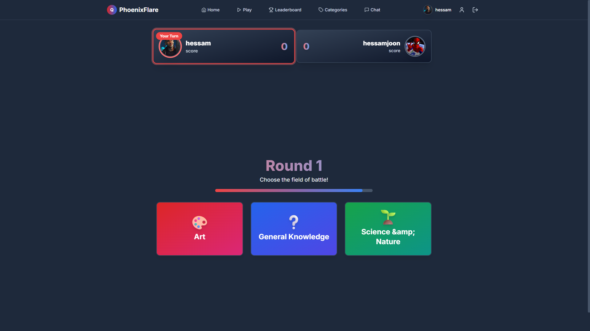
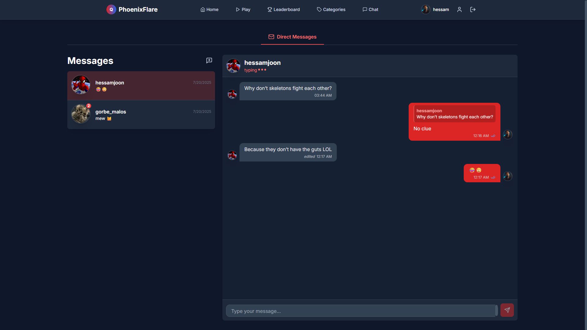

# PvPQuizApp

A full-stack, real-time, multiplayer quiz application where users can challenge each other, chat, and compete on a wide variety of trivia questions. Built with a modern tech stack, PvPQuizApp is designed for scalability, performance, and a seamless user experience.

---

## Table of Contents

- [Features](#features)
- [Screenshots](#screenshots)
- [Tech Stack](#tech-stack)
- [Getting Started](#getting-started)
- [Project Structure](#project-structure)
- [Database Schema](#database-schema)
- [Backend Overview](#backend-overview)
- [Frontend Overview](#frontend-overview)
- [Testing](#testing)
- [Contributing](#contributing)
- [License](#license)

---

## Features

### General
- Real-time PvP quiz matches
- User authentication and profile management
- Rich chat system (group and direct messages)
- Admin panel for managing categories and questions
- Dynamic question categories and difficulty levels
- Leaderboards and player stats
- Responsive, modern UI

### Backend
- RESTful API with secure authentication
- WebSocket support for real-time gameplay and chat
- Robust database integrity checks
- Admin endpoints for content management
- Modular, scalable codebase

### Frontend
- Built with React + TypeScript
- State management with React Context
- Responsive design with Tailwind CSS
- Intuitive navigation and user flows
- Real-time updates via WebSockets

### Database
- Relational schema for users, games, questions, categories, chat, and stats
- Data import scripts for bulk question loading
- Integrity checks and migrations

---
## Screenshots

### 1. Home Page
<div align="center" style="display: flex; gap: 16px;">
  
  <div style="display: flex; flex-direction: column; gap: 8px;">
    
    
  </div>
</div>

---

### 2. Game Lobby
<div align="center">
  
</div>

---

### 3. Categories Page
<div align="center">
  
</div>

---

### 4. Quiz Match
<div align="center" style="display: flex; gap: 16px;">
  
  <div style="display: flex; flex-direction: column; gap: 8px;">
    
    
  </div>
</div>

---

### 5. Chat System
<div align="center">
  
</div>

---

### 6. Leaderboard System
<div align="center">
  
  
</div>

---

### 7. Profile Page
<div align="center">
  
  
</div>

---

### 8. Admin Panel
<div align="center">
  
</div>

---

## Tech Stack

- **Frontend:** React, TypeScript, Tailwind CSS, Vite
- **Backend:** Python, Flask (or FastAPI), WebSockets
- **Database:** PostgreSQL
- **Other:** Socket.IO, REST API, JWT Authentication


---

## How to Run and Use

### 1. Clone the Repository

```bash
# Clone the project
git clone <https://github.com/Hessam-Hosseinian/PvPQuizApp.git>
cd PvPQuizApp
```

### 2. Backend Setup

#### a. Create a Virtual Environment (Recommended)
```bash
python -m venv venv
source venv/bin/activate  # On Windows: venv\Scripts\activate
```

#### b. Install Python Dependencies
```bash
pip install -r requirements.txt
```

#### c. Configure Environment Variables
- Create a `.env` file in the project root (or configure in `config.py`).
- Example `.env` variables:
  ```env
  SECRET_KEY=your_secret_key
# Database Config
  DB_NAME=....
  DB_USER=....
  DB_PASSWORD=....
  DB_HOST=....
  DB_PORT=....


  ```

#### d. Create the Database
- The database schema is located at `app/sql/schema.sql`.
- You can create the database by running:
  ```bash
  python app/db.py
  # Or manually using a tool like sqlite3:
  # sqlite3 app.db < app/sql/schema.sql
  ```

#### e. Import Questions (Optional but recommended)
- To bulk import trivia questions:
  ```bash
  python import_questions.py
  ```
  This will load questions from the `opentdb_data2/` directory into your database.

#### f. Run the Backend Server
```bash
python app.py
```

### 3. Frontend Setup

```bash
cd frontend
npm install
npm run dev
```

- The frontend will typically run on `http://127.0.0.1:5173` (or as specified by Vite).
- Make sure the backend is running and accessible to the frontend (adjust API URLs if needed).

### 4. Access and Use
- Open your browser and go to the frontend URL.
- Register a new user or log in.
- Start a new game, join a chat, or explore the admin panel (if you have admin rights).

---

## Getting Started

### Prerequisites

- Node.js (v16+)
- Python (3.8+)
- pip

### Backend Setup

```bash
# Install Python dependencies
pip install -r requirements.txt


# (Optional) Import questions
python import_questions.py

# Run the backend server
python app.py
```

### Frontend Setup

```bash
cd frontend

# Install dependencies
npm install

# Start the development server
npm run dev
```

### Environment Variables

- Configure your environment variables in `config.py` and `.env` files as needed.

---

## Project Structure

```
PvPQuizApp/
  app/                # Backend application
    routes/           # API route modules
    sql/              # SQL schema and migrations
  frontend/           # React frontend
    src/
      components/     # UI and feature components
      pages/          # Page-level components
      services/       # API and socket services
      contexts/       # React context providers
  opentdb_data2/      # Bulk question data (JSON)
  static/             # Static files (uploads, avatars)
  tests/              # Backend tests
  requirements.txt    # Python dependencies
  package.json        # Frontend dependencies
```

---

## Database Schema

- **Users:** Authentication, profile, stats
- **Games:** Game sessions, player states, results
- **Questions:** Text, category, difficulty, answers
- **Categories:** Dynamic, admin-manageable
- **Chat:** Messages, threads, participants
- **Leaderboards:** Rankings, scores

> See `app/sql/schema.sql` for full schema details.

---

## Backend Overview

- **Framework:** Flask (or FastAPI)
- **API:** RESTful endpoints for all resources (users, games, questions, chat, admin)
- **WebSockets:** Real-time game and chat updates
- **Authentication:** JWT-based, secure endpoints
- **Admin:** Category/question management, user moderation
- **Data Import:** Bulk question loader (`import_questions.py`)
- **Integrity:** `db_integrity_check.py` for data validation

---

## Frontend Overview

- **Framework:** React + TypeScript
- **Routing:** Page-based navigation
- **State Management:** React Context for auth, game state, chat
- **UI:** Tailwind CSS, custom components
- **Real-Time:** Socket.IO for live updates
- **Pages:** Login, Register, Home, Game, Chat, Profile, Admin, Categories

---

## Testing

- **Backend:** Pytest-based test suite (`tests/`)
- **Frontend:** (Add details if you have frontend tests)
- **How to run:**
  ```bash
  # Backend
  pytest

  # Frontend (if applicable)
  npm run test
  ```

---

## Contributing

1. Fork the repo
2. Create your feature branch (`git checkout -b feature/YourFeature`)
3. Commit your changes (`git commit -am 'Add new feature'`)
4. Push to the branch (`git push origin feature/YourFeature`)
5. Open a Pull Request

---

## License

[MIT](LICENSE)

---

**Feel free to reach out for questions, suggestions, or contributions!** 